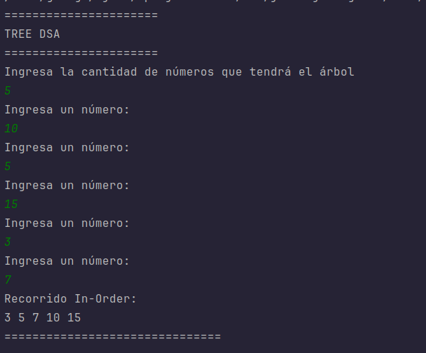
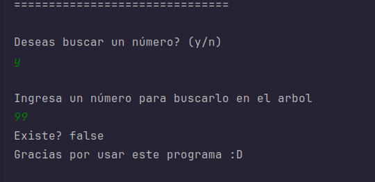

# Implementación de Árbol Binario de Búsqueda (BST) en Java

Este proyecto implementa un Árbol Binario de Búsqueda (Binary Search Tree - BST) en Java. Permite a los usuarios insertar números, visualizar el recorrido en orden (in-order) y buscar elementos específicos dentro de la estructura.

## Objetivo Educativo
La actividad busca que los estudiantes comprendan qué es un árbol binario y cómo se representa en Java, y que luego creen un programa básico que lo implemente.

## Cómo ejecutar el proyecto

1. **Clonar el repositorio**:
   ```bash
   git clone https://github.com/dageorge29/Arboles_EstructuraDeDatos.git
   ```
2. **Compilar y ejecutar**:
   Abre el proyecto en tu IDE favorito (IntelliJ IDEA, Eclipse, NetBeans) o compila desde la terminal:
   ```bash
   javac src/*.java
   java -cp src Main
   ```

## Estructura del Proyecto y Clases

El proyecto consta de tres clases principales ubicadas en la carpeta `src/`:

### 1. `Nodo.java`
Representa la unidad fundamental del árbol.
- **Atributos**:
  - `valor`: El dato entero almacenado.
  - `izquierdo`, `derecho`: Referencias a los nodos hijos.
- **Función**: Almacenar el dato y los enlaces a los subárboles.

### 2. `BinarySearchTree.java`
Contiene la lógica de la estructura de datos.
- **Métodos Principales**:
  - `insertar(int valor)`: Agrega un nuevo nodo en la posición correcta (menores a la izquierda, mayores a la derecha).
  - `recorrerInOrder(Nodo nodo)`: Imprime los valores ordenados de menor a mayor (Izquierda - Raíz - Derecha).
  - `existeValor(Nodo actual, int valorBusqueda)`: Busca recursivamente un valor y retorna `true` si existe, o `false` si no.

### 3. `Main.java`
Es el punto de entrada de la aplicación y maneja la interacción con el usuario.
- Permite ingresar la cantidad de nodos y sus valores.
- Muestra el recorrido in-order.
- Ofrece un menú interactivo para buscar números en el árbol.

## 🚀 Funcionalidades
1. **Insertar números en el árbol**: El usuario define cuántos nodos quiere y proporciona los valores.
2. **Mostrar el recorrido inorden**: Se evidencia el ordenamiento automático de los datos.
3. **Buscar un número**: Indica si un valor específico existe o no dentro del árbol.

## 📖 Desarrollo y Ruta Metodológica

### ¿Qué es un árbol binario?
Un árbol binario es una estructura de datos jerárquica donde cada elemento (llamado "nodo") tiene como máximo dos hijos:
- **Hijo izquierdo**: Contiene valores menores que el nodo padre.
- **Hijo derecho**: Contiene valores mayores que el nodo padre.

Esto permite que operaciones como la búsqueda sean muy eficientes, similar a buscar en una guía telefónica dividiendo siempre las páginas a la mitad.

### ¿Cómo se implementó?
Se utilizó el paradigma de **Programación Orientada a Objetos (POO)** en Java.
- La clase `Nodo` define la estructura.
- La clase `BinarySearchTree` encapsula las operaciones usando **recursividad** para recorrer y manipular la estructura (tanto para insertar como para buscar).
- La clase `Main` utiliza `java.util.Scanner` para capturar la entrada del usuario en consola.


## 💻 Ejemplo de Ejecución en Consola

A continuación se muestra un ejemplo de cómo interactúa el programa:








### Desarrollador
Jorge Andrés Murillo Rivera


---
**Nota**: También se puede ver el código directamente desde el repositorio desde el directorio 'src', ahí encontrarás todas las clases.
